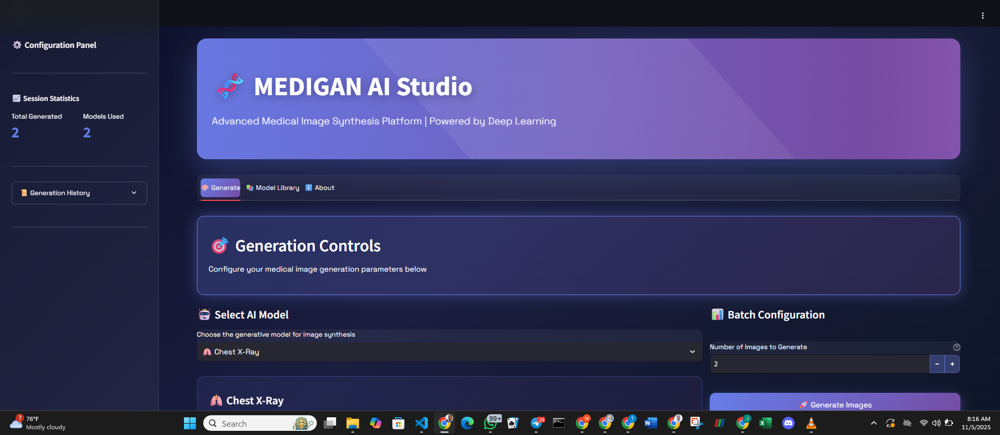
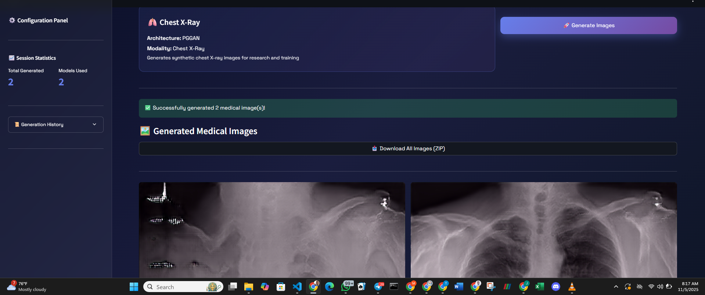
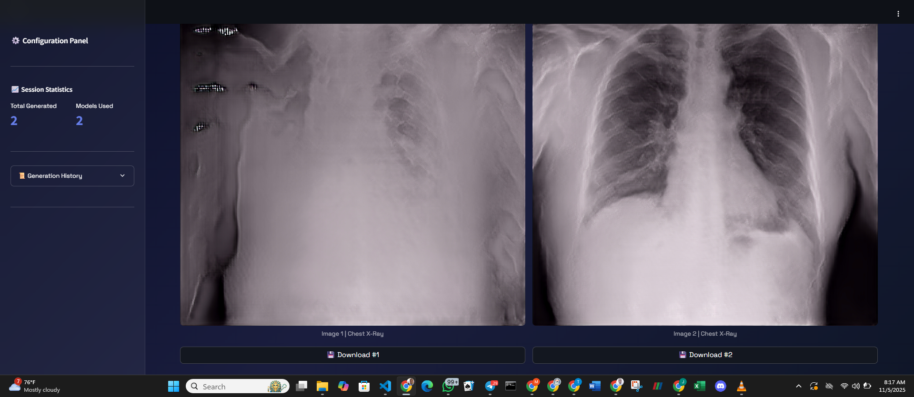

<p align="center">
  
  
  
  
  
  
</p>

<p align="center">
  
  
</p>

# 🧬 MEDIGAN AI Studio


**MEDIGAN AI Studio** is a high-performance, interactive web application for generating synthetic medical images. Built with Streamlit and powered by the medigan library, this tool addresses the critical need for accessible, privacy-preserving medical imaging data. It provides a stunning, user-friendly interface for researchers, students, and AI developers to generate a variety of medical images across different modalities and GAN architectures, directly from their browser.

---

## 🚀 Key Features

* 🎨 **Stunning, Modern UI:** A custom-built interface with a dark gradient theme, glassmorphism, and animated elements for an engaging user experience.
* 🤖 **Multi-Model Support:** Leverages several types of Generative Adversarial Networks (GANs), including DCGAN, CycleGAN, Pix2Pix, and PGGAN.
* 🏥 **Diverse Modalities:** Generates images for multiple medical use cases, including Mammography (calcifications, masses, density) and Chest X-Rays.
* ⚙️ **Interactive Controls:** Easily select the AI model, specify the number of images to generate (up to 7 per batch), and get instant results.
* 📊 **Real-time Dashboard:** A dynamic sidebar tracks session statistics, including the total number of images generated and a history of generation events.
* 📦 **Batch Generation & Download:** Generate multiple images at once and download them individually or as a convenient, time-stamped ZIP archive.
* 📚 **Built-in Model Library:** An explore-and-discover tab detailing all available models, their architectures, and their specific use cases.
* 🔒 **Privacy-Preserving:** Generates 100% synthetic data, bypassing patient privacy and data access (HIPAA/GDPR) concerns.

---

## 📸 Screenshots



---

## 📊 Architecture & Data Flow

This application operates on a simple, effective data flow. The Streamlit frontend captures user requests, which are processed by a Python backend that interfaces directly with the medigan library to perform the complex task of image generation.

### Application Flowchart


### Flow Description

* **User Interaction:** The user selects a generative model and the desired number of images from the "Generate" tab.
* **Backend Trigger:** Clicking "Generate Images" triggers the `generate_images` function in the Streamlit backend.
* **Model Invocation:** The backend initializes the `medigan.Generators()` class and calls the `get_as_torch_dataloader` method with the selected model ID and sample count.
* **Generation:** The medigan library handles the download, installation of dependencies, and execution of the pre-trained GAN model.
* **Image Processing:** The generated PyTorch tensors are iterated over, converted to PIL Images, and collated into a list. For models like Pix2Pix, both the sample and its corresponding mask are combined into a single grid image.
* **Display & Download:** The resulting PIL images are displayed in the Streamlit UI. The "Download All" button zips these images from memory and makes them available to the user.

---

## 💾 Dataset & Data Source Description

This application does not use a static, local dataset. Instead, it acts as an intelligent interface to the medigan library, which is a curated, open-source collection of pre-trained Generative Adversarial Networks (GANs).

The "datasets" are, in effect, the latent spaces of these complex, pre-trained models. Each model was trained on a specific, private medical dataset to learn its underlying data distribution. By sampling from this learned distribution, the app can generate novel, synthetic images that are statistically similar to the original (unseen) training data.

### The synthetic data this app can generate includes:

* **Mammography Calcification ROIs:** Regions of Interest (ROIs) from mammograms, specifically focusing on calcifications.
* **Mammography Mass ROIs:** ROIs from mammograms that contain mass-like structures.
* **Full Mammography (Density):** Full-field mammogram images that can be generated with varying breast densities.
* **Mammography Masses with Masks:** A paired output (image + segmentation mask) that generates a mammogram region with a mass and its corresponding pixel-level annotation.
* **Chest X-Rays:** High-resolution synthetic Chest X-Ray (CXR) images.

---

## 🤖 Available Models

| Model ID                         | Name                          | Architecture | Modality    | Description                                                         |
| -------------------------------- | ----------------------------- | ------------ | ----------- | ------------------------------------------------------------------- |
| 00001_DCGAN_MMG_CALC_ROI         | Mammography Calcification ROI | DCGAN        | Mammography | Generates regions of interest containing calcifications.            |
| 00002_DCGAN_MMG_MASS_ROI         | Mammography Mass ROI          | DCGAN        | Mammography | Generates regions of interest containing masses.                    |
| 00003_CYCLEGAN_MMG_DENSITY_FULL  | Mammography Density (Full)    | CycleGAN     | Mammography | Generates full mammography images with varying breast densities.    |
| 00004_PIX2PIX_MMG_MASSES_W_MASKS | Mammography Masses with Masks | Pix2Pix      | Mammography | Generates mammography masses with corresponding segmentation masks. |
| 00019_PGGAN_CHEST_XRAY           | Chest X-Ray                   | PGGAN        | Chest X-Ray | Generates synthetic chest X-ray images for research and training.   |

---

## 🛠️ Technology Stack

* **Core Framework:** Streamlit
* **Generation Engine:** medigan
* **AI & Image Processing:** PyTorch & Torchvision
* **Image Manipulation:** Pillow (PIL)
* **Styling:** Custom HTML & CSS

---

## ⚙️ Installation & Local Setup

To run this application on your local machine, follow these steps:

### Clone the Repository:

```bash
git clone https://github.com/Otto-Destiny/medigan-ai-studio.git
cd medigan-ai-studio
```

### Create a Virtual Environment:

```bash
python -m venv venv
source venv/bin/activate  # On Windows: venv\Scripts\activate
```

### Install Dependencies:

A `requirements.txt` file is included for easy setup.

```bash
pip install -r requirements.txt
```

### Run the Application:

```bash
streamlit run app.py
```

Your browser should automatically open to [http://localhost:8501](http://localhost:8501).

---

## 📁 Project Structure

```
MEDIGAN-AI-Studio/
├── app.py           # Main Streamlit application script
├── requirements.txt # Python dependencies
└── README.md        # This file
```

---

## 🤝 Contributing

Contributions are welcome! If you have suggestions for improvements, new models to add, or bugs to fix, please feel free to:

1. Fork the repository.
2. Create a new feature branch (`git checkout -b feature/AmazingFeature`).
3. Commit your changes (`git commit -m 'Add some AmazingFeature'`).
4. Push to the branch (`git push origin feature/AmazingFeature`).
5. Open a Pull Request.

---

## **Disclaimer:**

>  The images generated by this application are synthetic and intended for research, development, and educational purposes only. They are not real patient data and must not be used for clinical diagnosis or patient care.
## 🙏 Acknowledgments

Developed by **Destiny Otto**  
As part of the **WorldQuant University AI Lab: Deep Learning for Computer Vision** program.

📧 Contact: destinymanuchi.otto@gmail.com  
🌐 Linkedin: [Destiny Otto](https://linkedin.com/in/destiny-otto)


## 📜 License

The project code and framework are licensed under the **Creative Commons Attribution-NonCommercial-NoDerivatives 4.0 International License**.

To view a copy of this license, visit:
[http://creativecommons.org/licenses/by-nc-nd/4.0/](http://creativecommons.org/licenses/by-nc-nd/4.0/)


---